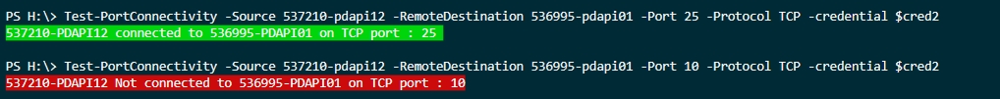

# Tests Ports Between Devices

## Examples

```powershell
Test-PortConnectivity -Source '127.0.0.1' -RemoteDestination 'dc1' -Port 57766
```

```powershell
Test-PortConnectivity '127.0.0.1' 'dc1' 57766 -Protocol UDP -Iterate
```

```powershell
Test-PortConnectivity 'localhost' 'dc2' 51753 -Protocol UDP
```

```powershell
Test-PortConnectivity -Source $EUCAS -RemoteDestination $EUMBX -Port 135 -Iterate
```

```powershell
Test-PortConnectivity -Source 'localhost' -RemoteDestination '127.0.0.1' -Port 135 -Iterate -protocol TCP
```

