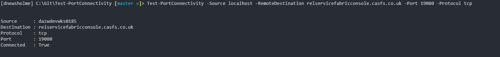

# Tests Ports Between Devices

A set of cmdlets for testing connectivity between devices, can make use of powershell remoting and jobs.

Powershell Core compatible.

## Testing Port Examples

### Test TCP port from localhost

```powershell
Test-PortConnectivity -Source 'localhost' -RemoteDestination 'dc1' -Port 57766
```

### Continous port ping from localhost

```powershell
Test-PortConnectivity '127.0.0.1' 'dc1' 57766 -Protocol TCP -Iterate
```

### Test port from a remote machine to a destination

```powershell
Test-PortConnectivity -Source server01.contoso.com -RemoteDestination server02.contoso.com -Port 135 -credential $credential
```


[](https://app.fossa.io/projects/git%2Bgithub.com%2Fdnewsholme%2FTest-PortConnectivity?ref=badge_shield)

## Create Listening Port Examples

### Create Listening Port on localhost

```powershell
Publish-ListeningPort -port 443
```

### Create Listening Port on localhost as background job

```powershell
Publish-ListeningPort -port 443 -asjob
```

### Create Listening Port on localhost and close after first connection to port

```powershell
Publish-ListeningPort -port 443 -exitonconnect
```

### Create Listening Port on remote machine as a background job and close on connect

```powershell
Publish-ListeningPort -port 443 -remotedestination server01.contoso.com -exitonconnect -asjob -credential $credential
```


## License
[](https://app.fossa.io/projects/git%2Bgithub.com%2Fdnewsholme%2FTest-PortConnectivity?ref=badge_large)